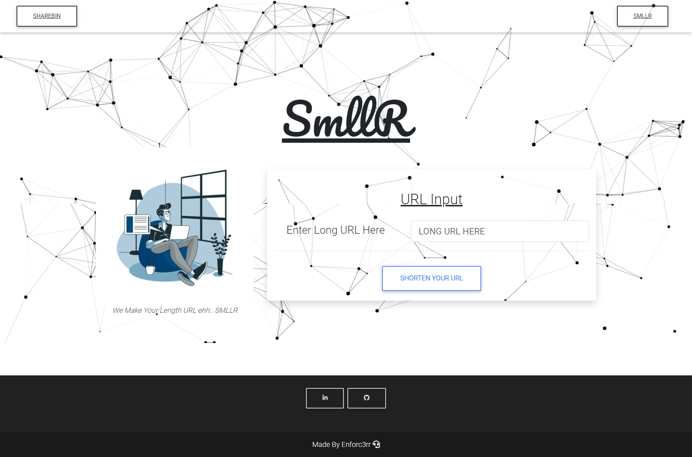

# SMLLR & ShareBin
In the world where sharing of well formatted data has become a necessity and Our URL lengths have gotten longer.
That's where SmllR and Sharebin will come into play as it's obvious by the naming scheme that

- **Smllr** is going to be useful for making lengthy URLs shorter. 
- **Sharebin** will allow users to share text documents in well formatted manner as it uses markdown as markup language.


## Tech Stack Used :

- ### Frontend - ReactJs , Bootstrap 
- ### Backend - NodeJs(ExpressJs) , Java(Spring Boot)
- ### Database - MySQL , MongoDB , Redis  


#### Note : 
I chose MySQL as a primary database for Smllr and ShareBin because I planned to add User Service and some dashboard like stuff for urls and sharebin docs generated by a user 
to this web application but because of some time constrains I have not been able to do it yet.


## Important Detail And Diagrams -

### System Design Diagram :


### Data-Flow Diagram


### Working And Importance Of Different Services :

- ### Key Generation Service (NodeJs/ExpressJs)
  - #### About 
      - This service's primary work is to generate the unique keys which can be used by SmllR or Sharebin service to assign that unique key to their content.
      - Under the hood , KeyGen Server uses In-built Crypto Module of Nodejs to work and generate unique keys in hex encoding every minute.
  - #### Working
     - KeyGen Service uses mongoDB to primarily store the keys but instead of just providing the key straight out of mongoDB , in order to speed up the process of key retrieval redis is used.
     - The way Redis is integrated is , It keeps 15 keys in its database that it automatically retrieves those keys whose `isBeingUsed` is marked as false and in retrieval process it marks them true from MongoDB when key count in Redis falls below 4.
     - Thus , Redis acts as a primary database for key retrieval purpose.
  - #### Importance Of Such design
     - Importance of having such design is that time required to retrieve keys from server reduces down to 1/10th of what it would have taken to retrieve it from a database like MongoDB.
     
- ### SMLLR Service (Java/Spring Boot)
  - #### About
    - This service is used to Shorten lengthy URL .
  - #### Working
    - The way this service works is that it makes GET request to Key Generation Service and Assign that URL a unique key.
    - The way Redis is integrated in this service is after we numberOfClicks Counter becomes more than 5 , it transfers that key and url associated with it to redis thus URL response time reduces to 1/6th of what it was taking without redis.
    - URL counter is increased a-synchronously.
    - For now after 10 (number ) hits , URL is deleted from database and Key's `isBeingUsed` value is updated to false.
  - #### Importance of Such design 
    - Importance of choosing such System design is that the URL that is getting popular , it's response time is significantly reduced.
- ### Sharebin Service (Java/Spring Boot)
  - #### About
    - This service is used to save the formatted text documents written in Markdown Markup Language.
  - #### Working
    - This works in a very Simple way , It basically makes GET request to the Key Generation Service and Assign that key to the created markdown Document.

## Response Time :
- #### KeyGeneration Service  


- #### SmllR Service  

Before (Data gets saved to redis)  


After (Data gets saved to redis) 


## Endpoints :

- ### Key-Generation Service  
  - GET : /localhost:8000/key/getKey
  - PUT : /localhost:8000/key/updateKeyStatus/:KeyValue
- ### ShareBin Service 
  - GET : /localhost:8081/sharebin/create (Content-Type : multipart/form-data )
  - POST : /localhost:8081/sharebin/get/:Key
- ### SMLLR Service 
  - GET : /localhost:8080/smllr/get/:keyValue
  - POST : /localhost:8081/smllr/add (Content-Type : application/json)


## Models :

- #### Key Model
```
  key : String ,
  isBeingUsed : Boolean
```

- #### SmllR Model
```
{
  shortenUrlPart : String ,
  mainUrl : String ,
  creationDate : Date, 
  numberOfClicks : int
}
```

- #### ShareBin Model
```
{
    shareBinKey : String ,
    shareBinTitle : String ,
    shareBinCode : String ,
    numberOfClicks : int
}
```

## Working 


## UI :

#### SmllR ( Desktop Version )


#### SmllR ( Mobile Version )


#### ShareBin ( Desktop Version )


#### ShareBin ( Desktop Version )


#### ShareBin ( Mobile Version )


#### ShareBin ( Mobile Version )


