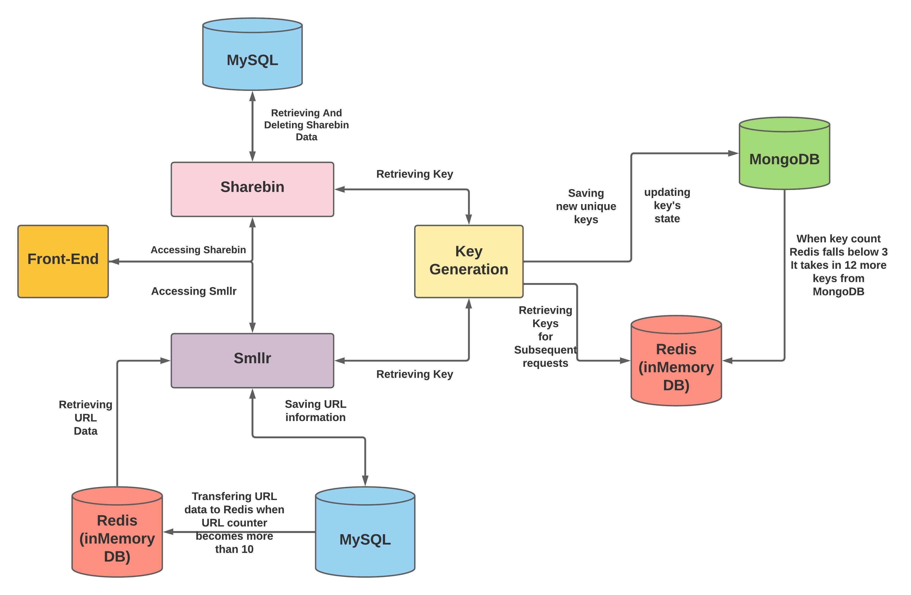

# SMLLR & ShareBin
In the world where sharing of well formatted data has become a necessity and Our URL lengths have gotten longer.
That's where SmllR and Sharebin will come into play as it's obvious by the naming scheme that

- Smllr is going to be useful for making lengthy URLs shorter. 
- Sharebin will allow users to share text documents in well formatted manner as it uses markdown as markup language.

## Tech Stack Used :

- ### Frontend - ReactJs , Bootstrap5 
- ### Backend - NodeJs/ExpressJs , Java(Spring Boot)
- ### Database - MySQL , MongoDB , Redis  

#### Note : 
I chose MySQL as a primary database for SmllR and ShareBin because I planned to add User Service and some dashboard like stuff for urls generated by a user 
to this web application but because of some time constrains I have not been able to do it yet.

## Important Detail And Diagrams -

### Working And Importance Of Different Services :

- ### Key Generation Service (NodeJs)
  - #### About 
      - This service's primary work is to generate the unique keys which can be used by SmllR or Sharebin service to assign that unique key to their content.
      - Under the hood , KeyGen Server uses In-built Crypto Module of Nodejs to work and generate unique keys in hex encoding every minute.
  - #### Working
     - KeyGen Service uses mongoDB to primarily store the keys but instead of just providing the key straight out of mongoDB , in order to speed up the process of key retrieval redis is used.
     - The way Redis is integrated is , It keeps 15 keys in its database that it automatically retrieves from MongoDB when key count in Redis falls below 4.
     - Thus , Redis acts as a primary database for key retrieval purpose.
  - #### Importance 
     - Importance of having such design is that time required to retrieve keys from server reduces down to 1/10th of what it would have taken to retrieve it from a database like MongoDB.
     
- ### SMLLR Service (Java)
  - #### About
    - 
    
  
    

### System Design Diagram :

### Data-Flow Diagram

## UI :

#### SmllR ( Desktop Version )

#### SmllR ( Mobile Version )

#### ShareBin ( Desktop Version )

#### ShareBin ( Desktop Version )

#### ShareBin ( Mobile Version )

#### ShareBin ( Mobile Version )

